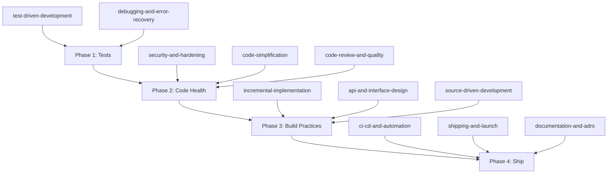

# Skills-Driven Enhancement Roadmap for Scene Sentry

Scene Sentry is a well-structured FastAPI monolith (v2.0.0) with AI ranking, multi-provider content ingestion, gossip scraping, reminders, and a polished Jinja2/Tailwind UI. It reads as a **completed MVP** -- feature-rich but not production-hardened. The 23 engineering skills map cleanly to taking it from "works on my machine" to "ready to ship with confidence."

Below is a phased approach, grouped by development lifecycle stage.

---

## Phase 0: Foundation -- Define and Plan (Before Writing Code)

### Skills: `interview-me`, `idea-refine`, `spec-driven-development`, `planning-and-task-breakdown`

These are **process skills**, not code changes. Use them at the start of every significant piece of work going forward.

**How to use them on Scene Sentry:**

- **`interview-me`** -- Before building the next feature (e.g., the orphaned `Recommendation` system, book content support), invoke this skill to clarify what you actually want. The current codebase has a `Recommendation` model that's dead code -- interview-me would have caught whether recommendations are still in scope before the model was written.

- **`spec-driven-development`** -- Write a short PRD before starting any new feature. Example candidates right now:
  - The recommendation/search-log system (models exist but nothing else does)
  - Book content type (model supports it, no UI/routes exist)
  - Durable task queue (replacing in-memory `TaskManager`)

- **`planning-and-task-breakdown`** -- After the spec, decompose into small tasks with acceptance criteria. For instance, "add Alembic migrations" breaks down into: install alembic, generate initial migration from current schema, wire into CI, document workflow.

- **`idea-refine`** -- Use when you have a vague goal like "make the app production-ready." It would generate concrete variations: containerize vs. serverless, Alembic vs. raw SQL, Redis queues vs. Postgres-backed, etc.

**Trigger:** Invoke these skills whenever you say "build me X" or "I want to add Y" in a new chat session.

---

## Phase 1: Quality Gates -- Testing and Debugging (Highest Impact)

### Skills: `test-driven-development`, `browser-testing-with-devtools`, `debugging-and-error-recovery`

**This is the single highest-impact area.** Scene Sentry has zero tests despite `pytest` + `pytest-asyncio` being declared as dev dependencies.

### `test-driven-development`

Concrete application to Scene Sentry:

- **Unit tests (80%)** -- Repository layer is the easiest starting point:
  - `app/repositories/content_repository.py` -- test CRUD, dedup logic, search
  - `app/repositories/library_repository.py` -- test status transitions, rating updates
  - `app/repositories/gossip_repository.py` -- test feed queries, cleanup
  - Service layer: `ContentDiscoveryService` provider orchestration, `RankingService` invalidation logic, `ReminderService` due-reminder filtering

- **Integration tests (15%)** -- Route-level tests with TestClient:
  - Auth flow (login, register, session handling)
  - Library CRUD via `/api/library` endpoints
  - Content search via `/api/search`
  - Gossip refresh cycle

- **E2E tests (5%)** -- Full page rendering:
  - Dashboard loads with stats
  - Library page shows correct items after add/remove

- **Test infrastructure to create:**
  - `tests/conftest.py` with SQLAlchemy test database, fixtures for users/content/library items
  - `pytest.ini` or `pyproject.toml` pytest config
  - Coverage configuration (`pytest-cov`)

### `browser-testing-with-devtools`

Use the browser MCP to verify the running app:
- Check the dashboard renders correctly at `localhost:8000/dashboard`
- Verify SSE task notifications work (the `static/js/app.js` has ~1000 lines of client JS)
- Profile page load performance (the Tailwind CDN approach may be slow)
- Catch console errors from Alpine.js / Clerk SDK interactions

### `debugging-and-error-recovery`

Apply its five-step triage (reproduce, localize, reduce, fix, guard) to known issues:
- The catch-all route `GET /{content_id}` -- fragile if new top-level routes are added
- Library routes bypassing the repository layer (raw SQLAlchemy queries)
- `Recommendation` model would crash if imported (references non-existent `User.recommendations`)

---

## Phase 2: Code Health -- Review and Simplify

### Skills: `code-review-and-quality`, `code-simplification`, `security-and-hardening`, `performance-optimization`

### `code-review-and-quality`

Run a five-axis review on the current codebase. Known issues it would catch:

- **Dead code:** `app/models/recommendation.py` (not imported, not used), deprecated `summary` field on `Gossip`, duplicate `TMDbService` vs `TMDbProvider`
- **Change sizing:** Some files are large -- `static/js/app.js` is ~1000 lines, `app/routes/library.py` mixes raw SQL with route handlers
- **Consistency:** Most routes use the repository pattern; library routes don't

### `code-simplification`

Apply Chesterton's Fence (understand before removing) then simplify:

- **`app/database.py`** -- Hand-rolled PostgreSQL migrations via `_run_migrations()` with raw SQL. Simplify by adopting Alembic.
- **`app/services/content_service.py`** (TMDbService) vs `app/services/providers/tmdb_provider.py` -- likely redundant; consolidate.
- **Library routes** -- Extract raw SQLAlchemy into `LibraryRepository` methods (pattern already exists for other entities).
- **`manage.py`** CLI -- Could use `typer` or FastAPI's built-in CLI instead of raw argparse.

### `security-and-hardening`

Concrete gaps the skill would identify and fix:

| Gap | Fix |
|-----|-----|
| ARCHITECTURE.md claims CSRF protection but none exists | Add CSRF tokens to Jinja2 forms via middleware |
| `RATE_LIMIT_API` config exists but is not wired to `/api/*` routes | Apply slowapi limiter to API router |
| `GET /api/gossip/latest` is unauthenticated | Add `RequireAuthDep` or decide it's intentionally public |
| Default `SECRET_KEY` in dev config | Add startup validation that rejects defaults in production |
| No `.env.example` | Create one so secrets aren't guessed from README |
| OWASP Top 10 audit | Input validation on all POST routes, CSP headers, dependency audit |

### `performance-optimization`

Measure-first approach for Scene Sentry:

- **Tailwind CDN** in dev -- switch to a build step (`npx tailwindcss`) for production; CDN loads the entire framework
- **Database queries** -- N+1 risk in library/content listing; add eager loading or joined queries
- **LangGraph ranking** -- Gemini API calls are slow; profile with timing and consider caching rank results (already has `UserContentRank` table, but invalidation strategy matters)
- **Static assets** -- No cache headers, no minification, no bundling for `app.js`

---

## Phase 3: Build Practices -- Implementation Quality

### Skills: `incremental-implementation`, `source-driven-development`, `doubt-driven-development`, `context-engineering`, `api-and-interface-design`, `frontend-ui-engineering`

### `incremental-implementation`

**Use going forward for every feature.** Scene Sentry's MVP was apparently built in larger chunks. Future work should follow thin vertical slices:
- Example: Adding the recommendation system should be: (1) model + migration, (2) repository, (3) service, (4) API route, (5) UI -- each committed and tested independently.

### `source-driven-development`

Ground framework decisions in official docs. Relevant right now:
- **FastAPI lifespan** -- verify the scheduler setup in `main.py` follows current FastAPI patterns (lifespan context manager vs. deprecated `on_event`)
- **SQLAlchemy 2.x** -- ensure async patterns are used correctly (the codebase uses sync sessions with `asyncio.to_thread`)
- **LangGraph** -- verify the 5-node graph follows current LangGraph best practices (the API evolves fast)

### `doubt-driven-development`

Apply to high-stakes decisions before they ship:
- The in-memory `TaskManager` -- is this safe for your deployment model?
- The ranking graph's loop-if-low-diversity logic -- does it actually terminate?
- Clerk webhook verification -- is the Svix implementation correct?

### `context-engineering`

Optimize your Cursor setup for this project:
- The `.cursor/rules/git-commits.mdc` exists but is minimal
- Add project-specific rules: layer boundaries (routes must not call repositories directly), naming conventions, import ordering
- Add an `AGENTS.md` or enhanced `.cursor/rules/` for the codebase patterns

### `api-and-interface-design`

The `/api/*` JSON endpoints need contract hardening:
- No OpenAPI response models defined (FastAPI supports `response_model`)
- No versioning strategy (all routes are unversioned)
- Error responses are inconsistent (some return JSON, some redirect)
- The catch-all `/{content_id}` route is a contract smell

### `frontend-ui-engineering`

The Jinja2 + Tailwind + Alpine.js UI is already polished. Skills application:
- **Accessibility (WCAG 2.1 AA)** -- audit keyboard navigation, screen reader support, color contrast in the dark theme
- **Component consistency** -- the `templates/partials/` pattern is good; extend to more shared components
- **Design system alignment** -- the `temp_design_directory_for_reference/` mocks exist; verify the built UI matches them

---

## Phase 4: Ship -- Deploy with Confidence

### Skills: `git-workflow-and-versioning`, `ci-cd-and-automation`, `shipping-and-launch`, `documentation-and-adrs`, `deprecation-and-migration`

### `git-workflow-and-versioning`

Already partially in place (Commitizen, conventional commits). Enhance:
- Enforce commit message validation in CI (not just pre-commit)
- Add branch protection rules for `main`
- Target ~100-line PRs (the skill's change sizing guidance)

### `ci-cd-and-automation`

The biggest gap. Currently only `release.yml` (version bumping). Add:

```
.github/workflows/
├── ci.yml          # On PR: lint (ruff), typecheck (mypy), test (pytest), coverage
├── release.yml     # Existing: commitizen bump
├── deploy.yml      # On tag: build + deploy to target platform
└── security.yml    # Weekly: dependency audit (pip-audit or safety)
```

- Add `ruff` and `mypy` to pre-commit hooks
- Add test + coverage gates that block merge

### `shipping-and-launch`

Pre-launch checklist for Scene Sentry:
- [ ] Dockerfile + docker-compose for reproducible deployment
- [ ] `.env.example` with all required variables documented
- [ ] Health check endpoint (exists: `/health`) verified by deploy platform
- [ ] Error monitoring (Sentry or equivalent)
- [ ] Database backup strategy
- [ ] Replace in-memory TaskManager with durable solution (Redis/Postgres queue)
- [ ] Tailwind production build (purged CSS)
- [ ] Static asset fingerprinting / cache headers

### `documentation-and-adrs`

Record key decisions:
- **ADR-001:** Why PostgreSQL over SQLite (README says SQLite, code uses Postgres)
- **ADR-002:** Why hand-rolled migrations over Alembic
- **ADR-003:** Why in-memory task manager (and plan to replace it)
- **ADR-004:** Auth strategy -- Clerk vs session-based (both exist; when to use which?)
- Move `ARCHITECTURE.md` out of `.gitignore` so collaborators can see it

### `deprecation-and-migration`

Clean up technical debt:
- **Remove** `app/models/recommendation.py` if not planned, or spec it out if it is
- **Deprecate** the `summary` field on `Gossip` model (already noted as deprecated in code)
- **Consolidate** `TMDbService` and `TMDbProvider` into one path
- **Fix** the README SQLite references to match the actual Postgres setup
- **Migrate** from `create_all` + raw SQL to Alembic

---

## Phase 5: Meta -- Ongoing Skill Usage

### Skills: `using-agent-skills`, `interview-me` (recurring)

### `using-agent-skills`

This is the meta-skill that routes incoming work to the right workflow. It should be your **default entry point** -- when you start a new chat session, it automatically determines which skill applies based on what you're doing:

- "Add a feature" -> `interview-me` -> `spec-driven-development` -> `planning-and-task-breakdown` -> `incremental-implementation`
- "Fix a bug" -> `debugging-and-error-recovery`
- "Review this code" -> `code-review-and-quality`
- "Ship this" -> `shipping-and-launch`
- "Is this safe?" -> `doubt-driven-development`

---

## Recommended Priority Order



**Start with Phase 1** (tests) because everything else is safer with a test suite backing it. Then Phase 2 (clean up known issues with safety net in place). Phase 3 and 4 can partially overlap. Phase 0 and 5 are ongoing process skills -- use them from this point forward on every task.

---

## Quick Reference: When Each Skill Triggers

| You say... | Skill that activates |
|------------|---------------------|
| "Build me X" / "Add feature Y" | `interview-me` -> `spec-driven-development` -> `planning-and-task-breakdown` |
| "I have a rough idea for..." | `idea-refine` |
| "Implement this spec" | `incremental-implementation` + `test-driven-development` |
| "Fix this bug" / "Why is this broken?" | `debugging-and-error-recovery` |
| "Review this code" / "Is this PR good?" | `code-review-and-quality` |
| "Simplify this" / "This is too complex" | `code-simplification` |
| "Is this secure?" / "Audit security" | `security-and-hardening` |
| "Make it faster" / "Performance issues" | `performance-optimization` |
| "Is this correct?" / "High stakes decision" | `doubt-driven-development` |
| "What does the official docs say?" | `source-driven-development` |
| "Check this in the browser" | `browser-testing-with-devtools` |
| "Set up CI" / "Add deploy pipeline" | `ci-cd-and-automation` |
| "Ship this" / "Deploy to production" | `shipping-and-launch` |
| "Remove old code" / "Migrate from X to Y" | `deprecation-and-migration` |
| "Document this decision" | `documentation-and-adrs` |
| "Commit this" / "Create PR" | `git-workflow-and-versioning` |
| "Set up my Cursor rules" | `context-engineering` |
| "Design this API" / "Define the contract" | `api-and-interface-design` |
| "Build this UI" | `frontend-ui-engineering` |
