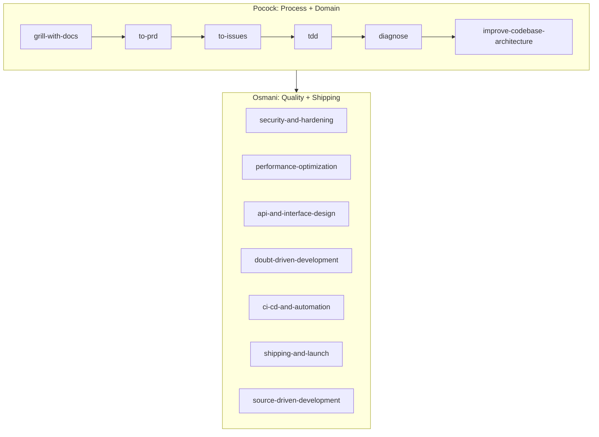

# Osmani vs Pocock: Agent Skills Comparison

## Philosophy

These two repos solve the same fundamental problem -- "AI agents default to the shortest path and skip the practices that make software reliable" -- but from **different angles**.

**Addy Osmani** (addyosmani/agent-skills, 43.8k stars, 23 skills):
- **Encyclopedic lifecycle coverage.** A skill for every phase: Define, Plan, Build, Verify, Review, Ship.
- Rooted in **Google's engineering culture** -- Hyrum's Law, Beyonce Rule, Chesterton's Fence, trunk-based development.
- Each skill is **long, self-contained**, with anti-rationalization tables, red flags, and verification checklists.
- Design goal: the agent should behave like a **senior staff engineer** who never cuts corners.

**Matt Pocock** (mattpocock/skills, 94.1k stars, 16 skills):
- **Lean, composable, opinionated.** Skills are short (10-100 lines), designed to be hacked and adapted.
- Rooted in **Domain-Driven Design + Pragmatic Programmer** -- shared language (CONTEXT.md), deep vs shallow modules, ADRs.
- Design goal: the agent should be a **disciplined pair programmer** who asks hard questions and keeps the codebase navigable.
- Unique ecosystem feature: `CONTEXT.md` as a living glossary that every skill reads and updates.

---

## Head-to-Head: Overlapping Skills

### 1. Grilling / Interviewing (the "what do you actually want?" skill)

| Aspect | Osmani: `interview-me` | Pocock: `grill-me` / `grill-with-docs` |
|--------|------------------------|----------------------------------------|
| Length | ~220 lines, highly structured | `grill-me`: 10 lines. `grill-with-docs`: 88 lines |
| Approach | Explicit confidence scoring (0-100%), structured restate template (Outcome/User/Why now/Success/Constraint/Out of scope), formal stop condition ("can I predict the next 3 answers?") | "Interview me relentlessly. Ask one at a time. If the codebase can answer it, explore instead of asking." |
| Unique strength | Anti-sycophancy guidance ("watch for 'sounds good' vs real yes"), "want vs should want" detection | `grill-with-docs` updates CONTEXT.md and ADRs inline as decisions crystallize -- the interview produces artifacts, not just alignment |
| Verdict | **More rigorous process.** Better for greenfield or when you don't know what you're building. | **More practical.** Better for ongoing projects where domain language matters. `grill-with-docs` is the unique killer feature here. |

### 2. Debugging

| Aspect | Osmani: `debugging-and-error-recovery` | Pocock: `diagnose` |
|--------|----------------------------------------|---------------------|
| Length | ~300 lines | ~120 lines |
| Approach | Five-step triage: Reproduce, Localize, Reduce, Fix, Guard. Flowchart decision trees. Stop-the-line rule. | Six phases: Build feedback loop, Reproduce, Hypothesise (3-5 ranked), Instrument, Fix + regression test, Cleanup. |
| Unique strength | Broader scope (covers production incidents, safe fallbacks, escalation). Anti-rationalization table. | **Phase 1 is brilliant** -- "build a feedback loop" is the entire skill. Lists 10 creative ways to construct one (failing test, curl script, bisection harness, differential loop, fuzz loop). The insight "build the right feedback loop and the bug is 90% fixed" is worth the whole skill. Also: tagged debug logs (`[DEBUG-a4f2]`) for easy cleanup. |
| Verdict | **Osmani is more comprehensive.** But **Pocock's Phase 1 (feedback loop) is genuinely better** -- more creative, more practical, and has the single best debugging insight in either repo. |

### 3. TDD

| Aspect | Osmani: `test-driven-development` | Pocock: `tdd` |
|--------|-----------------------------------|---------------|
| Length | ~380 lines, includes code examples (TypeScript, React, API, E2E) | ~110 lines, links to supporting docs (tests.md, mocking.md, deep-modules.md) |
| Approach | Full test pyramid (80/15/5), DAMP over DRY, Beyonce Rule, browser testing integration, per-cycle checklist | Vertical slices (explicitly anti-horizontal), behavior over implementation, links to interface design for testability |
| Unique strength | More prescriptive (exact ratios, specific patterns), includes browser testing guidance, covers more test types | **The anti-pattern section is sharper** -- "DO NOT write all tests first, then all implementation" with clear diagrams. Focus on deep modules and testable interfaces via linked docs. |
| Verdict | **Osmani for breadth** (pyramid, browser, patterns). **Pocock for the core TDD discipline** (vertical slices, anti-horizontal, interface-first). |

### 4. Architecture / Code Quality

| Aspect | Osmani: `code-simplification` + `code-review-and-quality` | Pocock: `improve-codebase-architecture` |
|--------|-----------------------------------------------------------|-----------------------------------------|
| Approach | Chesterton's Fence, Rule of 500, five-axis review, change sizing | Deep vs shallow modules, deletion test, seams and adapters, locality and leverage |
| Unique strength | Concrete rules (Rule of 500, ~100-line PRs, severity labels) | **The "deepening" framework is genuinely novel.** The deletion test, the deep/shallow module vocabulary, and the integration with CONTEXT.md + ADRs make this more than a review -- it's an architectural improvement loop. |
| Verdict | **Osmani for code review.** **Pocock for architectural evolution.** They do different things. |

### 5. Planning / Specs

| Aspect | Osmani: `spec-driven-development` + `planning-and-task-breakdown` | Pocock: `to-prd` + `to-issues` |
|--------|-------------------------------------------------------------------|--------------------------------|
| Approach | Write a full PRD first, then decompose into tasks with acceptance criteria and dependency ordering | Synthesize from conversation context (no interview), then break into vertical-slice issues on the issue tracker |
| Unique strength | More thorough spec process, includes testing and boundary definitions | **Issue tracker integration.** Issues are published directly to GitHub/Linear with triage labels, HITL/AFK classification, and blocker dependencies. The `to-issues` vertical slice rules are excellent. |
| Verdict | **Osmani for the spec itself.** **Pocock for turning specs into actionable work items.** |

---

## Skills Unique to Each Repo

### Osmani-only (no Pocock equivalent)

| Skill | What it does | Value for Scene Sentry |
|-------|-------------|----------------------|
| `doubt-driven-development` | Adversarial self-review with cross-model escalation | High -- for your ranking agent, auth, and data migration decisions |
| `source-driven-development` | Ground framework decisions in official docs | High -- FastAPI/SQLAlchemy/LangGraph all evolve fast |
| `security-and-hardening` | OWASP Top 10, auth patterns, secrets management | High -- you have auth, user data, API keys |
| `performance-optimization` | Measure-first profiling, Core Web Vitals | Medium -- Tailwind CDN, N+1 queries, Gemini API latency |
| `frontend-ui-engineering` | Component architecture, accessibility, design systems | Medium -- your Jinja2/Tailwind UI |
| `api-and-interface-design` | Contract-first design, error semantics | High -- your `/api/*` routes need response models |
| `browser-testing-with-devtools` | Chrome DevTools MCP for live runtime data | Medium -- SSE, Alpine.js, Clerk interactions |
| `ci-cd-and-automation` | Quality gate pipelines, shift left | High -- you only have release.yml |
| `deprecation-and-migration` | Code-as-liability, zombie code removal | Medium -- orphan models, TMDb duplication |
| `shipping-and-launch` | Pre-launch checklists, staged rollouts | High -- no Dockerfile, no monitoring |
| `git-workflow-and-versioning` | Trunk-based dev, atomic commits | Low -- already have Commitizen |
| `documentation-and-adrs` | ADRs, API docs | Medium -- but Pocock's ADR system is better |
| `context-engineering` | Optimize agent context (rules files, MCP) | Low -- meta-skill |
| `incremental-implementation` | Thin vertical slices | Low -- Pocock's `to-issues` covers this |
| `idea-refine` | Divergent/convergent thinking | Low -- situational |

### Pocock-only (no Osmani equivalent)

| Skill | What it does | Value for Scene Sentry |
|-------|-------------|----------------------|
| `grill-with-docs` | Grilling that updates CONTEXT.md and ADRs inline | **Very high** -- your project has no shared glossary; this would create one |
| `improve-codebase-architecture` | Deep/shallow module analysis with deletion test | **Very high** -- identify shallow wrappers, consolidate TMDb services, fix library layer bypass |
| `triage` | Issue tracker state machine with agent briefs | High -- if you use GitHub Issues for tracking work |
| `to-issues` | Break plans into vertical-slice GitHub Issues | High -- publish directly to issue tracker |
| `to-prd` | Synthesize conversation into PRD + publish | Medium -- less thorough than Osmani's spec skill, but faster |
| `prototype` | Throwaway code to answer a design question | Medium -- useful for testing ranking UX or state models |
| `zoom-out` | Quick codebase orientation | Low -- helpful for new sessions |
| `handoff` | Compact conversation for another agent | Medium -- useful for multi-session work |
| `caveman` | 75% token reduction mode | Low -- nice-to-have utility |
| `setup-matt-pocock-skills` | Per-repo config for all Pocock skills | Required -- run this once for Scene Sentry |

---

## The Verdict: Use Both, Not Either

These repos are **complementary, not competing.** They overlap in ~5 areas but approach them differently, and each has ~10 skills the other doesn't cover at all.

### Recommended Strategy: Pocock as Process Layer, Osmani as Quality Layer

### When to reach for which:

- **"I want to build something new"** -- Start with Pocock: `grill-with-docs` (builds CONTEXT.md) then `to-prd` then `to-issues`. Use Osmani's `interview-me` only if you genuinely don't know what you want yet (it's more thorough but slower).

- **"I need to write code"** -- Pocock's `tdd` for the core red-green-refactor loop. Osmani's `test-driven-development` when you need the test pyramid guidance or browser testing patterns.

- **"Something is broken"** -- Pocock's `diagnose` (the feedback loop philosophy is better). Fall back to Osmani's `debugging-and-error-recovery` for production incidents or when you need the formal triage flowchart.

- **"Is this code good?"** -- Osmani's `code-review-and-quality` + `code-simplification` for the review itself. Pocock's `improve-codebase-architecture` for the deeper "should the architecture change?" question.

- **"Is this safe/correct/production-ready?"** -- Osmani only: `security-and-hardening`, `doubt-driven-development`, `performance-optimization`, `shipping-and-launch`. Pocock has no equivalents for these.

- **"Ship it"** -- Osmani only: `ci-cd-and-automation`, `shipping-and-launch`, `deprecation-and-migration`. Pocock doesn't cover CI/CD or deployment.

- **"The codebase is getting messy"** -- Pocock's `improve-codebase-architecture` (the deep module framework is unique and excellent). Then Osmani's `code-simplification` for the actual refactoring.

- **"I need to track and manage work"** -- Pocock only: `triage` + `to-issues`. Osmani has no issue tracker integration.

### Conflicts to resolve (where both fire and could contradict):

There are no hard conflicts. The only overlaps where you might get different advice are:

1. **Grilling** -- If you say "grill me," both `interview-me` (Osmani) and `grill-me` (Pocock) would trigger. Prefer `grill-with-docs` because it produces CONTEXT.md. Reserve `interview-me` for truly greenfield work where you need the confidence-scoring rigor.

2. **TDD** -- Both have a TDD skill. Pocock's is leaner and more opinionated (vertical slices only). Osmani's covers more ground (pyramid, browser, patterns). Use Pocock's for the day-to-day loop; reference Osmani's when you need guidance on test types or the Beyonce Rule.

### First steps for Scene Sentry specifically:

1. **Run Pocock's `/setup-matt-pocock-skills`** to configure your issue tracker, triage labels, and doc layout.
2. **Run `grill-with-docs`** on Scene Sentry to create a `CONTEXT.md` glossary (content, library items, gossip, rankings, discovery state -- these terms need precise definitions).
3. **Run Osmani's `security-and-hardening`** to audit the CSRF gap, unrate-limited API, and auth inconsistencies.
4. **Use Pocock's `improve-codebase-architecture`** to identify the shallow modules (TMDb service duplication, library route bypass, orphan recommendation model).
5. **Use Osmani's `ci-cd-and-automation`** to build the missing CI pipeline -- Pocock has nothing for this.
